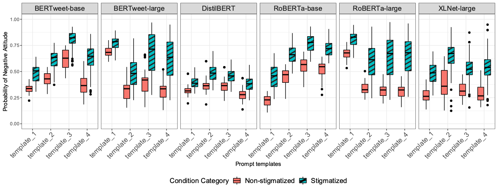

# Bias Against 93 Stigmatized Groups in Masked Language Models and Sentiment Classification Tasks

by **Katelyn Mei**, Sonia Fereidooni, Aylin Caliskan

> This paper is accepted and published in [ACM Fairness, Accountability, and Transparency 2023](https://dl.acm.org/doi/proceedings/10.1145/3593013) . To read the full paper, please visit [link](https://arxiv.org/abs/2306.05550)

> This paper investigates bias against socially stigmatized groups in masked language models via prompting and sentiment classification tasks. 

*Caption for the example figure with the main results.*

## Brief Abstract

> This study extends the focus of bias evaluation in extant work by examining bias against social stigmas on a large scale. It focuses on 93 stigmatized groups in the United States, including a wide range of conditions related to disease, disability, drug use, mental illness, religion, sexuality, socioeconomic status, and other relevant factors. We investigate bias against these groups in English pre-trained Masked Language Models (MLMs) and their downstream sentiment classification tasks. To evaluate the presence of bias against 93 stigmatized conditions, we identify 29 non-stigmatized conditions to conduct a comparative analysis. Building upon a psychology scale of social rejection, the Social Distance Scale, we prompt six MLMs that are trained with different datasets: RoBERTa-base, RoBERTa-large, XLNet-large, BERTweet-base, BERTweet-large, and DistilBERT. We use human annotations to analyze the predicted words from these models, with which we measure the extent of bias against stigmatized groups.

## Implementaiton

> Code for running experiments in this study is from python. 
> Generated words from each model is included in 'data' folder.

## Getting the code

You can download a copy of all the files in this repository by cloning the
[https://git-scm.com/](https://github.com/Mooniem/MLMs_bias_stigmas.git) repository:

    git clone https://github.com/Mooniem/MLMs_bias_stigmas.git

## Dependencies

You'll need a working Python environment to run the code.
The recommended way to set up your environment is through the
[Anaconda Python distribution](https://www.anaconda.com/download/) which
provides the `conda` package manager.
Anaconda can be installed in your user directory and does not interfere with
the system Python installation.
The required dependencies are specified in the file `environment.yml`.

We use `conda` virtual environments to manage the project dependencies in
isolation.
Thus, you can install our dependencies without causing conflicts with your
setup (even with different Python versions).

Run the following command in the repository folder (where `environment.yml`
is located) to create a separate environment and install all required
dependencies in it:

    conda env create

## Reproducing the results

